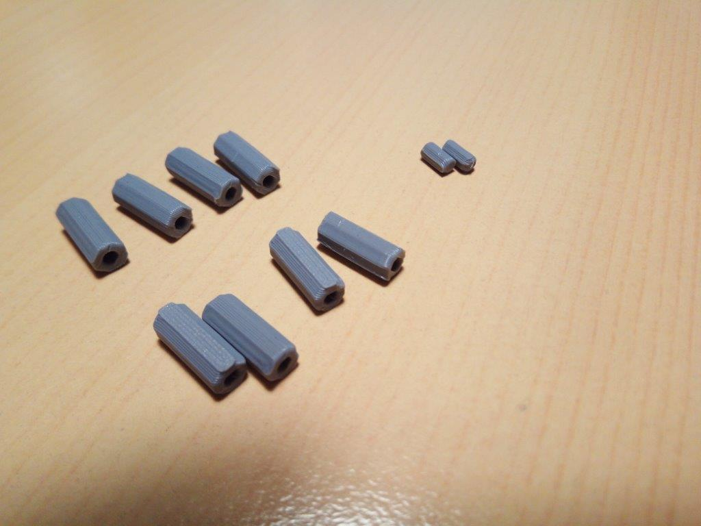

# CatFeeder-Slot

This project builds an automatic feeder for cats (or other small animals). The goal is build a complete, DIY solution,
from the fabrication of the container, to software are electronics. The feeder is managed using a web interface, so you
can configure it from your home network. Doubles as WIFI AP (for standalone operation) or WIFI client (for home network
integration).

This project provides:

1. The fabrication of the container. You 3D print the parts using the STL provided.
2. The software to control the feeder.
3. The electronics schemas to connect all the parts. 

<a href="https://youtu.be/_xY0Vlgl6Cg">Demo video on YouTube</a>

# Table Of Contents

1. [Project Features](#project-features)
2. [3D Printing and Assembly](#3d-printing-and-assembly)
    1. [Prototype](#prototype)
    2. [CatFeeder](#catfeeder)
        1. [Part list to print](#part-list-to-print)
        2. [Printing times](#printing-times)
        3. [Assembly](#assembly)
            1. [Mount the pins in the inner case](#mount-the-pins-in-the-inner-case)
            2. [Screw the base to the inner case](#screw-the-base-to-the-inner-case)
            3. [Mount the axis motor and support](#mount-the-axis-motor-and-support)
            4. [Iron the wires to battery holder](#iron-the-wires-to-battery-holder)
            5. [Build the 90 degree wires](#build-the-90-degree-wires)
            6. [Wiring diagram](#wiring-diagram)
            7. [Mount the UNL2003](#mount-the-unl2003)
            8. [Mount the ESP8266](#mount-the-esp8266)
            9. [Mount the cap](#mount-the-cap)

3. [How to install the Software](#how-to-install-the-software)
    1. [Arduino Board Setup](#arduino-board-setup)
    2. [Configuration options](#configuration-options)
    3. [Download the components to the Board](#download-the-components-to-the-board)
        1. [Check for good compilation](#check-for-good-compilation)
        2. [Download the FileSystem to the board](#download-the-filesystem-to-the-board)
        3. [Download the CatFeeder application to the board](#download-the-catfeeder-application-to-the-board)
4. [Configure CatFeeder](#configure-catfeeder)
    1. [Connect to the AP](#connect-to-the-ap)
5. [Using Catfeeder](#using-catfeeder) 
    1. [Calibration](#calibration)
    2. [Configure Schedules](#configure-schedules)


# Project Features

1. Fully printable container, so you can download the project, start your printer, and print all the parts. The STL are 
ready to print, so the orientation and tolerances are configured and tested.
2. Managed using web interface. Catfeeder provides a WWW server that provides the following capabilities:
    * Network configuration. DCHP / Static / AP operation
    * Calibration
    * NTP client, so we manage the current time.
    * Configuration persistence (SPIFFS).
    * Detailed log of Catfeeder's operation, so you can check what happen.
    * Modern HTML / JS interface, AJAX based operation.
    * Easy, flexible schedule configuration for feeding your pets. No limits on this (only the number of slots).
    * Capable of communicate using a Telegram Bot (Experimental).
3. Cheap to build. Based on standard hardware components:
    * ESP8266 Core on an NodeMCU LoLin v3 development board (about 7€)
    * Stepper motor: 28BYJ48 (5 motors about 6€)
    * Stepper motor driver: ULN2003 (5 drivers mounted on development board about 6€)
    * Printed on PLA
    * Some wiring cable (8 wires)
    * 4 allen screws (13mm)
    * 2 allen screws (6mm)
    * Powered on 4xAA batteries (6V)
    * 1 4xAA battery holder (5 holders about 4€)
    * 4 small screws to support the boards to pins
    * 4 pins to build the power connector
4. Easy of operation:
    * Cap is removable so you can clean / add the meal easily.
    * The shape is designed to be "safe" for your cats. They can't bump it.
    * Schedule the meals using the phone or your computer easily.
    * With 1 meal/day, you can serve a full week.
    * Very quiet operation, due the stepper motor.
    * Can be calibrated easily, using the web interface.

# 3D Printing and Assembly

All the parts are designed on Autodesk Inventor 2019. I provide two models, **CatFeeder** the "production" one, and the **Prototype** useful to develop new features, or test things. Printed on 
a Creality Ender-3 Pro, with generic brand PLA. These are the CURA settings for all the parts printed:

* Layer Height: 0.2
* Wall Thickness: 0.8
* Top/Botton Thickness: 0.8
* Top Layers: 4
* Bottom Layers: 4
* Infill: 20%, Lines
* Printing temperature: 195 ºC (for your PLA brand, may vary)
* Build plate temperature: 70 ºC
* Speed: 40 mm/s
* Cooling: Enable
* Fan Speed: 100%
* Enable supports: Everywhere
* Build Plate adhesion: None

## Prototype

This prototype is not usable to feed pets, buts prints fast, and is used to check some mechannical interfaces (axis, motor coupling, etc.) The prototype is an easy asembly, build from three printed parts:

* Hardware/3DPrinting/Prototype/floor.stl
* Hardware/3DPrinting/Prototype/mottor_support.stl
* Hardware/3DPrinting/Prototype/upper.stl

You also need:

* 6 female-female pin-to-pin cables (4 for motor wires, 1 for vcc, 1 for ground)
* 4 AA batteries
* A battery holder with two male pin soldered (to enable the connection)
* A ESP8266 Board
* Mini-USB Cable (to power the ESP8266 and check the serial debug)

  

## CatFeeder

This is the production-ready CatFeeder parts. CatFeeder has a diameter of **190mm**, and **650** of height. Each slots size **72mm x 90mm**. It takes some time to print, so be patient.
See the following diagram for more detail about measures.

  

### Part List to print

You need to print this files (included in the Repo):

* Hardware/3DPrinting/CatFeeder/1x_axis.stl 
* Hardware/3DPrinting/CatFeeder/1x_motor_support.stl  
* Hardware/3DPrinting/CatFeeder/1x_base.stl
* Hardware/3DPrinting/CatFeeder/1x_cap.stl
* Hardware/3DPrinting/CatFeeder/1x_inner_case.stl
* Hardware/3DPrinting/CatFeeder/2x_separator_battery.stl
* Hardware/3DPrinting/CatFeeder/8x_separator.stl

 
 
 
 
 

### Printing times

|part name  |cuantity|color|printing time|
|-----------|--------|-----|------------:|
|motor axis |1       |white|        00:45|
|base       |1       |green|        02:30|
|cap        |1       |white|        14:38|
|inner case |1       |green|        16:15|
|motor support |1    |white|        00:30|
|separator_battery|2 |grey |        00:05|
|separator        |8 |grey |        00:10|


### Assembly

To assemble the CatFeeder, you need the following:

* All the parts printed
* ESP8266 Core on an NodeMCU LoLin v3 development board
* Stepper motor: 28BYJ48
* Stepper motor driver: ULN2003
* Some wiring cable (10 wires)
* 4 allen screws (13mm)
* 2 allen screws (6mm)
* 4xAA batteries (6V)
* 1 4xAA battery holder
* 1 Micro USB cable to download the firmware
* An allen driver to screw the allen screws (nº 3)
* An Iron to solder the battery holder wires and build the 90 degree wires
* 4 small screws to support the boards to pins

#### Mount the pins in the inner case

Parts:
* Separators (8 big, 2 small)
* Inner Case (bottom side)

Push the pins (separators) in their holes to support the boards. The two small ones are the battery separator (2mm) and the 8 are the ULN2003 holder and ESP9266 holder, that fits in the big holes.
Push gently, and if you found too much resistence, file them lightly using a sharp knife. Also you can glue the pins to the base, but it shouldn't be needed.

 


#### Screw the base to the inner case

Parts:
* Inner Case
* Base
* 4 Screws (10mm, allen) 

Using the 4 long screws, screw the base to the inner case. File lightly the holes to ensure smooth fit.


#### Mount the axis motor and support

Parts:
* Motor Axis
* Motor Support
* 2 Screws (6mm, allen)

Push gently the motor into the axis. The axis (long part) has two pockets. One big, one small. In the photo you will see the big one, used to hold the cap. Push firmly but not to hard. It should be fitted
snugly. 

Now, get the motor support, and align it with the inner base (bottom) The protuding triangles are designed to be fitted in the triangle pockets in the inner case. Once fitted the support, screw the motor
to the inner case using the small screws. The support, the motor and the axis only have one way to be mounted.


#### Iron the wires to battery holder

Parts:
* Battery Holder
* Two wires (about 10cm each one)
* 4 pins to build the connector
* Iron

First of all, we need to "build" a connector for the power. Get a pin strip as the photo, and split two pairs of pins. Stack them, and iron the pins
together using the wires. You will get something like the connector in the photo.  Then, iron the wires to the battery holder. 
I usually iron the *red* one to the VCC (+) and the *black* to the GND (-).


#### Build the 90 degree wires

Parts:
* Simple female-female connection wires (10)
* Iron
* plier

I want to get a low-profile cat feeder, so I ended using 90 degrees cables to connect the ESP8266 and the UNL2003 motor driver, along the power supply. I get a standard
female-female connection wire, removing the plastic cap (a needle or sharp cutter is useful to extract the plastic cap), add some thermoretractile (while the pin is still
straight) and them, using the pliers, bend the end point to 90 degree. Apply some heat, and you have a 90-degree connection cable done. Repeat 10 times (4 wires for 
motor signals, 2 for power the ESP8266, 2 for power the UNL2003).


#### Wiring diagram

Wiring is easy. Just use the following diagram to connect the wires between power, ESP8266, UNL2003 and the stepper motor. I power the ESP8266 using 6V (4x1.5V) using the
voltage regulator provided by the development board. See the subsections about UNL2003 and ESP8266 for detailed photos. 


#### Mount the UNL2003 

Parts:
* Inner case
* UNL2003 Motor Driver
* 6 wires (4 for signals, 2 for power)
* Motor connector
* 2 small screws

Put the UNL2003 in their separators, and screw it to them using the small screws. I get these screws from iside a VHS video recorder found in the garbage. Plug in the
motor connector in the white connector holder (it has only one valid position to insert it). Last, connect the wires using the following table.

|UNL2003 Name|Color |ESP8266 PIN|
|------------|------|-----------|
|IN1         |Yellow|D1         |
|IN2         |Orange|D2         |
|IN3         |Grey  |D5         |
|IN4         |Blue  |D6         |
|-           |White |*power connector black*|  
|+           |Red   |*power connector red*|


#### Mount the ESP8266 

Parts:
* Inner case
* ESP8266 
* 4 wires coming from UNL2003
* 2 wires for power
* 2 small screws
* Micro-USB cable

First of all, connect the wires coming from UNL2003 using the previous table. Connect the power cables to the `GND2` (black wire) and `VIN` (red wire) pins, and screw 
it to the separators. Last, plug all the power wires to the battery holder connector. You shold have all connected and ready to go. Don't forget to plug the Micro-USB
cable to the ESP8266 in order to download the filesystem and firwware. The extra, unpluged wire in the photo is due a some test I was doing. Don't take it in mind.


#### Mount the cap

Parts:
* Cap
* Inner case fully assembled

First of all, remove all the support from the top of the cap. Use a sharp cutter. The cap has an axis that fits in the motor axis. This allows the cap to be removed to
put the food, clean the inner case, etc. The cap fits easily in the axis holder. You are done!.


# How to install the Software

CatFeeder uses [FSBrowserNG](https://github.com/gmag11/FSBrowserNG) as webserver. I forked it, to include some new functionality and fix some `delay()` calls that can't be used. You need the following libraries installed in your Arduino `libraries` folder.

* [my FSBrowserNG's fork](https://github.com/juanmcasillas/FSBrowserNG). See [the original page](https://github.com/gmag11/FSBrowserNG) for more info. Depends on:
    * [ArduinoJson-5.x](https://github.com/bblanchon/ArduinoJson/tree/5.x) (the 5.x branch)
    * [ESPAsyncTCP](https://github.com/me-no-dev/ESPAsyncTCP)
    * [ESPAsyncWebServer](https://github.com/me-no-dev/ESPAsyncWebServer)
    * [NtpClient](https://github.com/arduino-libraries/NTPClient)
    * [Time](https://github.com/PaulStoffregen/Time)
* [my Universal-Arduino-Telegram-Bot's fork](https://github.com/juanmcasillas/Universal-Arduino-Telegram-Bot). See [the original page](https://github.com/witnessmenow/Universal-Arduino-Telegram-Bot) for more info.

Then, get the [CatFeeder Repo](https://github.com/juanmcasillas/CatFeederCircular) and compile it using the Arduino IDE.

## Arduino Board Setup

I use a *NodeMCU LoLin v.3 ESP8266* board. You need some things in Arduino IDE in order to work:

* First install the serial driver, if not installed before, for your platform [CH340G Driver](http://www.wch.cn/download/CH341SER_EXE.html)

Then add ESP8266 aditional library:
* Go to `Preferences`, add in `Additional Board Manager URLs` the following URL: [http://arduino.esp8266.com/stable/package_esp8266com_index.json](http://arduino.esp8266.com/stable/package_esp8266com_index.json)
* Restart The Arduino IDE.
* Go to `Tools->Board->Board Manager` and search `ESP8266 by ESP8266 Community` library and install it (I use version `2.5.0`)
* Install the ESP8266FS Flash filesystem tools form Arduino. Uncompress [package](https://github.com/esp8266/arduino-esp8266fs-plugin/releases/download/0.1.3/ESP8266FS-0.1.3.zip) inside `C:\Software\Arduino\tools`
* Install Exception Decoder ESP8266. Not really needed to install the software, but can help you to troubleshoot some things if fail. Uncompress [package](https://github.com/me-no-dev/EspExceptionDecoder/releases/download/1.1.0/EspExceptionDecoder-1.1.0.zip) inside `C:\Software\Arduino\tools`
* Restart the Arduino IDE.

Now, You have to configure the Board options:

* Board: `NodeMCU 1.0 (ESP-12E Module)`
* Upload Speed: `921600` (If you can't connect at this speed, check the cable or select a lower speed)
* CPU Freq: `80 MHz`
* Flash Size: `4M (2M SPIFFS)`. This is importart. If you don't do select that, you can't flash the FileSystem.
* Debug port: `Disabled`
* Debug Level: `None`
* IWIP Variant: `v2 Lower Memory`
* VTables: `Flash`
* Exceptions: `Disabled`
* Erase Flash: `Only Sketch`
* Port: Your USB port.
* Programmer: `AVRISP mkII`

## Configuration options

in `catfeeder.h` you find the following `defines`:
* `#define CATFEEDER_SLOTS 8` number of slots. If you use the provided STL, leave in `8`
* `String CATFEEDER_CONFIG_FILE =  "/catfeeder.json"`. The configuration options.
* `String LOGGER_FILE = "/catfeeder.log". The log file where things are stored.

in `motorstepper.h` you find the pin-to-wire mapping:
* `const int motorPin1 = D1;   // D1  (GPIO14)      IN1     black`
* `const int motorPin2 = D2;   // D2  (GPIO12)      IN2     white`
* `const int motorPin3 = D5;   // D5  (GPIO13)      IN3     blue`  
* `const int motorPin4 = D6;   // D6  (GPIO15)      IN4     red` 

## Download the components to the Board

### Check for good compilation

 First of all, open `catfeedercircular.ino` file in *Arduino IDE* and issue a `Verify` to check that everything compiles (libraries, and so on). When you have a valid compilation, then you should have a log output like this:

 ```
Using library ESP8266WiFi at version 1.0 in folder: /Users/assman/Library/Arduino15/packages/esp8266/hardware/esp8266/2.5.0/libraries/ESP8266WiFi 
Using library Time at version 1.5 in folder: /Archive/Src/Arduino/libraries/Time 
Using library NtpClient at version 2.5.1 in folder: /Archive/Src/Arduino/libraries/NtpClient 
Using library ESPAsyncTCP at version 1.2.0 in folder: /Archive/Src/Arduino/libraries/ESPAsyncTCP 
Using library ESPAsyncWebServer at version 1.2.0 in folder: /Archive/Src/Arduino/libraries/ESPAsyncWebServer 
Using library ESP8266mDNS at version 1.2 in folder: /Users/assman/Library/Arduino15/packages/esp8266/hardware/esp8266/2.5.0/libraries/ESP8266mDNS 
Using library Ticker at version 1.0 in folder: /Users/assman/Library/Arduino15/packages/esp8266/hardware/esp8266/2.5.0/libraries/Ticker 
Using library ArduinoOTA at version 1.0 in folder: /Users/assman/Library/Arduino15/packages/esp8266/hardware/esp8266/2.5.0/libraries/ArduinoOTA 
Using library ArduinoJson at version 5.13.5 in folder: /Archive/Src/Arduino/libraries/ArduinoJson 
Using library FSBrowserNG at version 1.0.0 in folder: /Archive/Src/Arduino/libraries/FSBrowserNG 
Using library Hash at version 1.0 in folder: /Users/assman/Library/Arduino15/packages/esp8266/hardware/esp8266/2.5.0/libraries/Hash 
Using library Universal-Arduino-Telegram-Bot at version 1.1.0 in folder: /Archive/Src/Arduino/libraries/Universal-Arduino-Telegram-Bot 
/Users/assman/Library/Arduino15/packages/esp8266/tools/xtensa-lx106-elf-gcc/2.5.0-3-20ed2b9/bin/xtensa-lx106-elf-size -A /var/folders/cc/0xwh_8tn7xdf8834vtcvvlt00000gn/T/arduino_build_599193/catfeedercircular.ino.elf
Sketch uses 540636 bytes (51%) of program storage space. Maximum is 1044464 bytes.
Global variables use 40004 bytes (48%) of dynamic memory, leaving 41916 bytes for local variables. Maximum is 81920 bytes.
```

If you have some error, it has been a missing library, probably.

### Download the FileSystem to the board

Go to `Tools->ESP8266 Sketch Data Upload`. This put all the files in the flash partition of the board.

```
[SPIFFS] data   : /Archive/Src/CatFeederCircular/Software/catfeedercircular/data
[SPIFFS] size   : 2028
[SPIFFS] page   : 256
[SPIFFS] block  : 8192
/cal.png
/edit.html
/f1.png
/f2.png
/f3.png
/f4.png
/f5.png
/f6.png
/f7.png
/f8.png
/favicon.ico
/in.png
/index.html
/logo.png
/majax.js
/md5.js
/net.html
/net_auth.html
/net_config.html
/net_ntp.html
/out.png
/pickr.css
/pickr.js
/s.css
/schedule.html
/stats.html
/sys.html
/sys_bot.html
/sys_cal.html
/sys_config.html
/sys_info.html
/sys_reboot.html
/sys_update.html
[SPIFFS] upload : /var/folders/cc/0xwh_8tn7xdf8834vtcvvlt00000gn/T/buildb100809d879243ffa08dcd83fbd33c73.spiffs/catfeedercircular.spiffs.bin
[SPIFFS] reset  : nodemcu
[SPIFFS] port   : /dev/cu.wchusbserial1a140
[SPIFFS] speed  : 921600
[SPIFFS] address: 0x200000

warning: serialport_set_baudrate: baud rate 921600 may not work
Uploading 2076672 bytes from /var/folders/cc/0xwh_8tn7xdf8834vtcvvlt00000gn/T/buildb100809d879243ffa08dcd83fbd33c73.spiffs/catfeedercircular.spiffs.bin to flash at 0x00200000
................................................................................ [  3% ]
................................................................................ [  7% ]
................................................................................ [ 11% ]
................................................................................ [ 15% ]
................................................................................ [ 19% ]
................................................................................ [ 23% ]
................................................................................ [ 27% ]
................................................................................ [ 31% ]
................................................................................ [ 35% ]
................................................................................ [ 39% ]
................................................................................ [ 43% ]
................................................................................ [ 47% ]
................................................................................ [ 51% ]
................................................................................ [ 55% ]
................................................................................ [ 59% ]
................................................................................ [ 63% ]
................................................................................ [ 67% ]
................................................................................ [ 71% ]
................................................................................ [ 74% ]
................................................................................ [ 78% ]
................................................................................ [ 82% ]
................................................................................ [ 86% ]
................................................................................ [ 90% ]
................................................................................ [ 94% ]
................................................................................ [ 98% ]
............................             
```

### Download the CatFeeder application to the board

After that, you have all the files in the flash, and the last step to get the thing working is Download the CatFeeder sketch. Before this, If you want to 
comment out the debug output, you should edit `FSWebServerLib.h:24` and uncomment the following line:

```
// #define RELEASE  // Comment to enable debug output
```

I recommend you *leave* the log enabled, so you can check that everything starts, the mac address, etc. Ok, it's time to download the sketch. 
If you upload the sketch from Arduino IDE, you should see something like this in the output window:

```
/Users/assman/Library/Arduino15/packages/esp8266/tools/xtensa-lx106-elf-gcc/2.5.0-3-20ed2b9/bin/xtensa-lx106-elf-size -A /var/folders/cc/0xwh_8tn7xdf8834vtcvvlt00000gn/T/arduino_build_599193/catfeedercircular.ino.elf
Sketch uses 540684 bytes (51%) of program storage space. Maximum is 1044464 bytes.
Global variables use 40004 bytes (48%) of dynamic memory, leaving 41916 bytes for local variables. Maximum is 81920 bytes.
warning: serialport_set_baudrate: baud rate 921600 may not work
Uploading 544832 bytes from /var/folders/cc/0xwh_8tn7xdf8834vtcvvlt00000gn/T/arduino_build_599193/catfeedercircular.ino.bin to flash at 0x00000000
................................................................................ [ 15% ]
................................................................................ [ 30% ]
................................................................................ [ 45% ]
................................................................................ [ 60% ]
................................................................................ [ 75% ]
................................................................................ [ 90% ]
.....................................................                            [ 100% ]
```

Now, open the `Serial Monitor` window you will see the debug information and some useful stuff:
 
```
CatFeeder: Failed to open config file /catfeeder.json
AP Enable = 0
FS File: /cal.png, size: 36.13KB
FS File: /edit.html, size: 24.49KB
FS File: /f1.png, size: 43.08KB
FS File: /f2.png, size: 44.35KB
FS File: /f3.png, size: 44.04KB
FS File: /f4.png, size: 42.99KB
FS File: /f5.png, size: 43.31KB
FS File: /f6.png, size: 43.71KB
FS File: /f7.png, size: 42.28KB
FS File: /f8.png, size: 42.81KB
FS File: /favicon.ico, size: 1.12KB
FS File: /in.png, size: 139.03KB
FS File: /index.html, size: 2.03KB
FS File: /logo.png, size: 15.75KB
FS File: /majax.js, size: 5.07KB
FS File: /md5.js, size: 19.97KB
FS File: /net.html, size: 1.14KB
FS File: /net_auth.html, size: 4.13KB
FS File: /net_config.html, size: 6.39KB
FS File: /net_ntp.html, size: 6.72KB
FS File: /out.png, size: 59.51KB
FS File: /pickr.css, size: 14.78KB
FS File: /pickr.js, size: 45.21KB
FS File: /s.css, size: 4.56KB
FS File: /schedule.html, size: 5.50KB
FS File: /stats.html, size: 1.65KB
FS File: /sys.html, size: 1.43KB
FS File: /sys_bot.html, size: 2.62KB
FS File: /sys_cal.html, size: 4.37KB
FS File: /sys_config.html, size: 1.51KB
FS File: /sys_info.html, size: 2.60KB
FS File: /sys_reboot.html, size: 1.60KB
FS File: /sys_update.html, size: 4.43KB
FS File: /catfeeder.log, size: 679B

Failed to open config filevoid AsyncFSWebServer::defaultConfig()
Failed to open secret file
void AsyncFSWebServer::configureWifiAP()
Setting AP configuration ...
AP Pass disabled
---Flash LED during 250 ms 3 times. Old state = 1
AP IP address = 192.168.1.1
MAC Addr: 84:0D:8E:B0:71:97
Open http://192.168.1.1/ to manage the CatFeeder
Flash chip size: 4194304
Scketch size: 544832
Free flash space: 1548288
HTTP server started

OTA Ready
END Setup
```

This errors are ok the first time:

```
CatFeeder: Failed to open config file /catfeeder.json
Failed to open config filevoid AsyncFSWebServer::defaultConfig()
```

The interesting lines are:

```
AP IP address = 192.168.1.1
MAC Addr: 84:0D:8E:B0:71:97
Open http://192.168.1.1/ to manage the CatFeeder
```

You have the mac address, if you need to add them to the Wifi MAC filter, and the configured IP for the AP (Access Point). 

These mean that the CatFeeder schedule configuration `/catfeeder.json` file is not found, and the WIFI configuration file `/config.json` hasn't been found too. This is due
that a fresh installation doesn't create this files, and force the CatFeeder to start as Access Point to enable configuration. The board starts in this mode if it can't found
the configuration files, or it can't connect to the configured WIFI (see `FSWebServerLib.h:27`, by default it waits 60 seconds `#define WIFI_CONNECT_TIMEOUT_TO_AP 60`).

# Configure CatFeeder

## Connect to the AP

The AP SSID if build using `CATF` and the CHIPID (e.g. `CATF1563415`). So search this WIFI in your device (e.g. mobile) and connect to this WIFI. Then point you web
brower to `http://192.168.1.1` and you should see something like the following:


If you want to add the CatFeeder to your home network, do the following. Is not required to operate the CatFeeder, but it is easy to manage it. To add CatFeeder to your
home network, click on `Network Settings`


And now, configure the SSID, your password the IP for the CatFeeder (I suggest you not to use DHCP and put a high one, e.g. 250, and the gateway). Remember to add the
MAC address in your router table if your filter MAC addresses, *before* adding CatFeeder to the network. If everything goes fine, you should connect to your AP and
be able to ping the device from your home network. 


CatFeeder connects to NTP server to get the time. If you want to specify a nearby NTP server, go to Network Main Page, then click on NTP Settings and fill the following form:


# Using CatFeeder

## Calibration

First time you should calibrate it. After assembly it, the CatFeeder should be calibrated, but you can fine tune it. Go to System Administration, and click on `System Calibration`


So in this window, use the arrows to move the cap so the slot 1 is open. Check the marks in the inner case and the cap so they are aligned (centered). 
Press `Start` when you're ready. After getting catfeeder calibrated, you can check in the bottom menu if the system moves to
the specific slot. After check it, press `Restore` to move the CatFeeder to the slot `#1`


## Configure schedules

In the main page, press `Schedule` button. CatFeeder has 8 slots, and 7 programs (the first slot is open, so you can leave it with food the first time to your pet, but this doesn't count as program.). The slot number and 
the programs are not related, but if everything starts on 1, it's easy and clear. Use the `Clear` button to clear one program, `Reset All` to clear all at once. To select when
the program run, just insert a date and a time using the calendar provided. Note that programs are run in time order, not in schedule order. When you're done, press `Save`. 
CatFeeder starts to work, and move to the next slot if it have a program. Easy. If you want to check the logs, click on `Stats` button in the main page.


Hope you enjoy CatFeeder!
